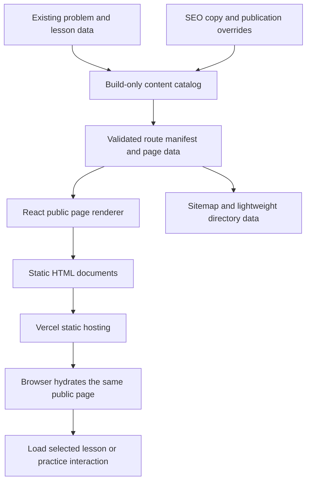

# Mathinking SEO implementation specification

Status: **The owner has merged and deployed the implementation.** See the [post-merge live regression report](seo-live-regression.md) for deployed-site verification and the local-only homepage typography follow-up. The proposal below is retained as the design baseline, not a claim that every release gate has passed.

Date: September 22, 2026. Source baseline: `2cba8fc`. Input: [SEO audit and marketing plan](seo-marketing-plan.md).

Installed baseline checked for this spec: Vite 8.0.13, React/React DOM 19.2.6, and Vercel Analytics 2.0.1. Use the existing lockfile and dependencies; package upgrades are not part of the SEO work.

## 1. Proposed outcome and boundaries

Search engines and visitors should receive useful educational HTML when opening a Mathinking URL. The page should identify itself correctly, link to related content, and retain its content when React starts. Lessons and individual AMC explanations will both serve as search entry points.

Keep React, Vite, Vercel, existing content records, and browser-local progress. Generate HTML **at build time**; do not introduce a runtime rendering server, database, CMS, Next.js migration, or separate SEO site. The homepage's headline, five-stage teaching method, C5/N4 previews, and starter links remain the design baseline.

Owner clarification during implementation: do not modify original shared animation scenes or their source data to address lesson readability. Archive animations must retain their original behavior. Any lesson-only presentation adjustment must remain isolated and undergo archive regression checks.

This specification covers metadata, static generation, public routes, discovery links, index controls, social assets, loading boundaries, checks, and rollout. New topic hubs, an About page requiring creator information, bulk content rewrites, video production, and external outreach remain later work. No ranking or indexing outcome is guaranteed.

## 2. Decisions proposed for review

| Decision | Proposed default | Reason |
| --- | --- | --- |
| Public identity | Mathinking | Already used by the current homepage, header, footer, and Learn page. |
| Preferred origin | `https://www.mathinking.org` | Existing live redirects already resolve there. Check Search Console before rollout if it documents a different established preference. |
| Rendering | Build-time React HTML plus hydration of the same public component | Provides readable HTML while retaining React and the current interactive components. |
| Lesson URLs | Preserve `/learn/C1`, etc. | Existing public URLs and navigation already work; no slug migration is needed. |
| New content URLs | `/archive/2026` and `/problems/amc8-2026-01` | Reuses existing year and problem identifiers. |
| Existing lessons | Keep all 50 reachable and index-eligible initially; fix all metadata | Existing `draft` labels alone must not trigger a mass deindexing change. Reconcile actual review status separately. |
| New problem-page rollout | Publish only a reviewed pilot of 25–50 dedicated problem pages first | Makes content and rendering review manageable; the complete bank stays usable in existing workflows. |
| Solutions and lesson discovery | Written solutions in native expandable HTML; separate lesson overview and optional worked recap | Content is present without requiring JavaScript, while students can still attempt activities before seeing the reasoning. |

The main review choices are the preferred host, staged problem-page publication, and the proposed placement of lesson overviews/recaps. Everything else below is an implementation proposal, not a request for separate approval at each coding step.

## 3. Architecture



The build-only catalog may import the complete bank and lesson specifications. Browser public-page components receive a small, page-specific data object. They must not import the full bank, full lesson registry, or animation registry merely to render titles, counts, directories, or written explanations.

`App` becomes a deterministic renderer receiving resolved page data. URL parsing moves to a pure resolver. The browser entry reads the generated page data and calls `hydrateRoot`; the build entry uses the same public page tree with `renderToString`. Browser-dependent features activate only after hydration or an explicit interaction.

Vite supports a separate rendering entry and static prerendering for known routes. The proposed use is limited to the build; no production Node server is required. [Vite rendering documentation](https://vite.dev/guide/ssr.html).

### Hydration contract

- Build render and first browser render receive identical public data and markup.
- No `window`, `localStorage`, random session selection, current timestamps, or animation timers affect that first render.
- A `ClientFeature` boundary initially renders a deterministic placeholder. After an effect, it imports the appropriate lesson, bank, dashboard, or practice component.
- Public headings, explanations, diagrams, navigation, and solution text remain outside that boundary. They are not replaced by a second copy of the page.
- Keep one shared header/footer and one main landmark. Refactor interactive bodies out of existing page wrappers where needed.
- Do not call `createRoot` on populated production HTML or suppress hydration warnings to hide mismatches. Use `createRoot` only for the development path with an empty root.

React requires matching initial content for hydration; mismatch errors are release failures. [React hydration guidance](https://react.dev/reference/react-dom/client/hydrateRoot).

## 4. Content and metadata contracts

Add a small SEO/editorial overlay without rewriting the existing problem and lesson schemas. Proposed types:

```ts
type PageKind =
  | "home" | "learn" | "lesson" | "practice" | "archive"
  | "year" | "problem-bank" | "problem" | "tips"
  | "license" | "dashboard" | "not-found";

interface PageRecord {
  id: string;
  kind: PageKind;
  path: string;                 // normalized, no query/hash
  contentId?: string;           // existing lesson/problem ID or year
  title: string;
  description: string;
  canonicalUrl?: string;        // absent for the 404 document
  indexable: boolean;
  includeInSitemap: boolean;
  imagePath: string;
  breadcrumbs: { label: string; path: string }[];
  modifiedAt?: string;          // verified content date, not build time
}

interface PublicContentOverride {
  contentId: string;
  routeEnabled: boolean;        // distinct from an existing lesson's draft label
  indexable: boolean;
  title?: string;
  description?: string;
  intro?: string;
  relatedProblemIds?: string[];
  relatedLessonIds?: string[];
  review?: { reviewedAt: string; reviewer: string };
}
```

Use a discriminated `PublicPageData` union for the actual body, separate from metadata. A problem page needs one statement, choices, image descriptions, answer, solution steps, provenance, and related links. A lesson page needs its introduction, objectives, prerequisites, optional reviewed recap, and related links. Full interactive lesson beats are loaded separately.

Generation rules:

1. Read existing identifiers from `sampleProblems`, curriculum nodes, and registered lesson specs; reject duplicate IDs and route collisions.
2. Seed the existing public lesson inventory explicitly. Do not equate `status: draft` with `routeEnabled: false`, and do not silently relabel lessons as approved.
3. New dedicated problem routes require an enabled, reviewed publication record. Unpublished problems remain available through the bank/practice UI.
4. Use the existing reviewed curriculum/problem mappings as candidate relationships. Verify referenced IDs and editorial relevance; never select related content randomly.
5. Omit unavailable links rather than producing a URL that returns 404. A release check reports missing expected links in the selected pilot.
6. Generate site counts from the actual public catalog and bank. Do not import the full bank in `HomePage` to display a count.
7. Keep authoring instructions, generated-problem validation notes, and private reviewer details out of public page data. A displayed author/reviewer name requires intentional public copy.

### Metadata output

Every public document gets one title, description, canonical, Open Graph URL/title/description/image, Twitter card, and appropriate robots directive. Titles use Mathinking consistently. Counts in titles and copy come from the catalog.

Replace scattered hard-coded `usePageMeta(title, description)` calls with a record-based metadata function. It updates or creates managed tags idempotently, including canonical and `og:url`. Build output remains authoritative; browser code must not temporarily point lessons at the homepage. Full-document anchor navigation remains the default, so no new client routing library is required.

Place page data in a non-executable JSON script. Escape `<` and script-closing sequences when serializing both page data and JSON-LD. Render plain content as React text, never unsanitized HTML. Validate local URLs before emitting links or filesystem paths.

Structured data in this release: homepage `WebSite`, truthful publisher information when available, and `BreadcrumbList` matching visible navigation. Remove the unsupported SearchAction and the generic four-Course block. Do not add video markup for SVG animations or promise deprecated educational rich results.

## 5. URL, index, and hosting behavior

| Request class | HTTP/result | Index policy |
| --- | --- | --- |
| `/`, `/learn`, `/practice`, `/archive`, `/problems`, `/tips`, `/license` | 200; real HTML and self-canonical | Indexable; meaningful public pages enter sitemap. |
| `/learn/{registered ID}` | 200; case-normalized existing ID | Existing 50 remain index-eligible; all get correct canonical/metadata. |
| `/archive/{published year}` | 200; reviewed year hub | Indexable once hub is published. |
| `/problems/{published problem ID}` | 200; complete written explanation | Indexable once pilot review passes. |
| `/dashboard` | 200; no personalized data in build HTML | `noindex`; never in sitemap. |
| `/practice?skill=...`, `?difficulty=...`, session variants | Existing filtering/session behavior retained | `noindex`; no sitemap entries. |
| `/problems?q=...` or `?problem=...` | Search or selected bank problem works after JS | `noindex`; no sitemap entries. |
| Public URL with only UTM/referral tracking | Same public content | Clean canonical; stays indexable. |
| Invalid lesson/problem/year, unknown route or asset | Actual HTTP 404 with recovery links | No sitemap; 404 document has no homepage canonical. |

Implement exact route matching and validate IDs against the manifest; replace the broad `startsWith` routing and homepage fallback. `/learn/not-real`, `/archive/2099`, and `/practice-extra` must not render successful content pages.

**Static file layout:** write `/index.html`, `/learn.html`, `/learn/C1.html`, `/archive/2026.html`, `/problems/amc8-2026-01.html`, and `/404.html`. Use extensionless public paths and no trailing slash except `/`.

**Vercel changes:** remove the catch-all homepage rewrite; set `cleanUrls: true` and `trailingSlash: false`; use permanent alternate-host and known-alias redirects. Keep generated files authoritative and validate a real custom/native 404 response on a deployment preview. Avoid a rewrite to a 404-looking page that still returns 200. Vercel supports clean URLs and conditional response headers in its existing static configuration. [Vercel configuration reference](https://vercel.com/docs/project-configuration/vercel-json).

Existing lowercase lesson aliases such as `/learn/c1` permanently redirect to `/learn/C1`. Known old `.../index.html` variants redirect to their clean route if encountered. Unknown aliases stay 404. Redirects preserve relevant query strings; no rule applies production-host redirects indiscriminately to preview deployments. The existing apex-domain redirect may be controlled by Vercel's domain settings and must be checked there to avoid a competing rule or loop.

### Query-specific indexing without a server

Static HTML cannot vary its robots tag by query. Add conditional `X-Robots-Tag: noindex` response headers for recognized functional query keys on `/practice` and `/problems`, using Vercel `headers` with query `has` conditions. Use separate rules for alternative keys, since multiple conditions in one rule mean they must all match. Keep the base document indexable and do not match all queries indiscriminately.

For these utility variants, the inherited clean canonical identifies the base document; exclusion relies on `noindex`, not on an assertion that every filtered result is equivalent. The browser also sets a matching robots meta tag after startup. Do not block these URLs in robots.txt. Verify header behavior on a Vercel preview, not just a local Vite server.

`q` should initialize the bank search, and `problem` should select an existing problem by ID. Preserve recognized parameters when changing filters; treat malformed values as invalid selections with a helpful message. Unknown query parameters must not cause a full-app crash or create sitemap entries.

## 6. Public page changes

### Homepage and directories

Keep the existing homepage layout and teaching copy. Build-render both C5/N4 mathematical previews, all starter links, the method explanation, and six strand anchors. Pass lightweight counts and summaries as props. Update initial metadata to match this lesson-led positioning.

Build-render Learn's complete existing directory. Prerequisite IDs become descriptive lesson links. Preserve `/learn#learn-...` targets. Practice gets a stable introduction and its current skill/difficulty navigation outside the interactive session boundary.

The bank and archive retain their browsing workspaces. Add an independent “Open full solution” link to eligible problem rows; do not place an anchor inside the existing row button. Use a row wrapper with a selection button and sibling link, or a full anchor where navigation is the intended action.

Give `/archive` a build-rendered year directory and `/problems` a concise public introduction plus links to published year/problem pages outside the client workspace. These pages must have useful discovery content even before their filters and selected-problem panels activate.

### Existing lesson page

Order of content:

1. Breadcrumbs and one H1 using the actual lesson title.
2. Brief learner-facing introduction, objectives, and prerequisite links.
3. Existing guided investigation, loaded as a client feature with its progression unchanged.
4. A reviewed worked recap in native `<details>` and a few relevant problem/next-lesson links.

All 50 lessons receive steps 1–2 and correct metadata in the first release. Start the richer recap treatment with C1, C5, N4, F1, C4, and G4. Reuse actual lesson facts; do not dump internal lesson notes or every gated beat into an SEO appendix. Keep the recap separate from the investigation so it does not force early disclosure of each activity's answer.

Refactor heading ownership between `LessonPage` and `LessonRenderer` to avoid duplicate primary headings. A failed interactive import leaves the public explanation readable and offers a retry.

### New problem page

Render a problem H1, source/year/number, statement, accessible diagram, answer choices, hints where appropriate, and a native `<details>` containing the complete answer and written steps. The solution works with JavaScript disabled.

After hydration, enable answer checking, bookmarking, and an animation loaded on demand. Reuse the existing statement/solution components and progress hook; extract shared presentational sections instead of mounting a second complete `ProblemWorkspace` beneath duplicate content. Existing practice sessions can retain their current answer-reveal flow.

Related content links include the year hub when published, an appropriate lesson, and neighboring or conceptually related published problems. An unavailable dedicated solution must never produce a dead link.

### New year page and partial publication

Publish a year hub when it has a useful introduction and a reviewed set of problem links. List all bank problems for that year in contest order. For a problem without a dedicated public page yet, offer “Try in problem bank” linking to `/problems?problem={id}`. For reviewed pages, link directly to their solution. Clearly distinguish the two actions; do not claim that every listed item has a new standalone explanation page.

This avoids creating hundreds of unreviewed public pages or broken links simply to establish the URL pattern. The full bank remains accessible throughout the staged rollout.

Proposed pilot selection: the 25 problems from 2026, subject to individual review, plus up to 25 examples supporting C1, C5, N4, F1, C4, and G4. Record exact IDs before implementation step 4 is reviewed. If a candidate fails review, leave its dedicated route disabled and retain the bank link; do not silently rewrite its mathematics to meet a page-count target.

### Small copy corrections

Replace remaining “loaded problems” and implementation-oriented copy. Correct the Tips link labelled “Browse problems by topic and difficulty,” which currently leads to the lesson directory; point it to `/practice` or rewrite its label. Reconcile the guide's “Start with problems, not lessons” section with guided discovery: encourage trying a problem first, then using a lesson to develop the idea. No broad homepage rewrite is needed.

## 7. Build pipeline and development

Replace `vite build` plus the current metadata-only `postbuild` with a single orchestrated `npm run build`:

1. Bundle `src/entry-static.tsx` for Node into a temporary build directory outside `dist` using Vite's rendering build mode.
2. Import its build-only catalog functions; validate content and produce page records plus lightweight public data.
3. Run the Vite client build, producing fingerprinted assets and a manifest in `dist`.
4. For every enabled route, render the matching public React tree, inject escaped page data and metadata into the built HTML template, and write the route's HTML file. Resolve required CSS from the client manifest.
5. Emit `sitemap.xml`, `robots.txt`, `404.html`, and a machine-readable build report. Sitemap entries use the preferred origin, are indexable, and correspond to successful generated routes. Omit `lastmod` unless a trustworthy content date is recorded.
6. Run output validation. Fail the build if required content is missing or if metadata/routes/assets are invalid; do not silently ship homepage fallbacks.

The build never needs to fetch production or launch Chrome to produce HTML. Existing content stays the source of mathematical truth. The rendering bundle and internal editorial data are not deployment artifacts. Remove the old `postbuild` entry so generation cannot execute twice or be bypassed by an unrelated command.

For development, retain Vite. A small development-only middleware can resolve public page data using the same catalog and `ssrLoadModule`; the empty development page mounts with `createRoot`. Production uses embedded data and hydration. Source edits invalidate the development catalog cache. This adds no production server.

For checking generated output locally, provide a minimal static preview tool that serves `.html` equivalents and actual 404 responses; normal Vite SPA fallback behavior is not sufficient evidence for hosting correctness. Vercel preview HTTP checks are the final authority for redirects, query headers, and 404 status.

## 8. Performance and interaction preservation

First isolate the biggest imports: static homepage/directories must not load the full problem bank, lesson registry, Recharts dashboard, or animation scene library. Per-page JSON contains only the content needed for that page; omit animation configuration until the player needs it where practical.

Load lesson specs by ID using an explicit dynamic import map, keeping generated teaching artifacts with the selected lesson. `LessonProblemBeat` currently imports the whole bank; replace that dependency with a resolver for the subset of bank problems referenced by the selected lesson. The general bank/practice workspace can still load the whole bank when that workflow starts; changing its storage format is not required for initial SEO correctness.

Defer the animation player behind a lazy boundary. A later bounded task can split individual scene modules. `sceneRegistry.ts` contains selection guards and fallback logic, so do not replace it with a naive type-to-component map. Extract lightweight selection metadata and preserve guards before changing scene imports. Written solutions remain available if a scene fails to load.

Preserve the `fmj-amc8-progress-v2` storage key, existing problem IDs, bookmarks, attempts, and solved/missed semantics. Read stored progress only after hydration; never write an empty initial state over an existing record. Randomized sessions are built only in client features. No server-rendered content depends on a user's progress.

Reserve space for diagrams and animation areas. Respect existing controls and reduced-motion behavior. Record fresh build sizes and mobile measurements; the old 1.70 MB transfer observation is a baseline clue, not a new-build budget. The first release gate is absence of unnecessary full-library downloads on homepage/Learn, plus no material regression on representative interactions. Set numerical budgets from the rendering trial results.

## 9. Social assets, trust, and measurement

Create an actual 1200×630 PNG preview card using the current Mathinking visual identity and a real C5 or N4 teaching example. Produce it from existing vector/HTML artwork; no new visual identity is needed. Add a real favicon and explicit icon links. Verify image decoding, MIME type, and preview appearance. One site-wide card is enough for the first release; per-lesson cards can follow.

Keep existing attribution and non-affiliation language. Do not infer creator credentials or publish reviewer names from internal records. About/contact additions need actual owner-provided information and can ship separately.

Retain Vercel Analytics. In a separate measurement step, add supported events for `lesson_start`, `animation_start`, `solution_open`, and `practice_attempt`; `solution_open` must also account for the native details interaction. Use content IDs and bounded categories, never answer text or personal data. Confirm custom-event availability under the existing analytics setup; an unavailable paid feature does not justify adding a new service automatically.

Capture Search Console/Bing baselines and submit the updated sitemap after release when account access is available. Those accounts are not required to prepare or locally validate the implementation. External outreach and posting are outside this implementation release.

## 10. Proposed file changes

Names are proposed implementation locations, not files already created.

| Area | Changes |
| --- | --- |
| `src/seo/site.ts`, `types.ts`, `routes.ts`, `metadata.ts` | Site identity, contracts, pure URL resolution, metadata serialization and browser application. |
| `src/seo/catalog.server.ts`, `content-overrides.json` | Build-only content adapters, route inventory, publication flags, editorial introductions and relationships. |
| `src/entry-static.tsx`, `src/main.tsx`, `src/App.tsx` | Static rendering entry, hydration entry, deterministic page dispatch. |
| `src/components/seo/ClientFeature.tsx`, `Breadcrumbs.tsx` | Browser-only interaction boundary and shared visible breadcrumbs. |
| Existing homepage/Learn/Practice/Archive/Bank/Lesson pages | Separate public content from interactive bodies; use page data instead of eager global imports. |
| `ProblemPage.tsx`, `ArchiveYearPage.tsx`, `NotFoundPage.tsx` | New public route templates and real missing-page UI. |
| Existing problem/lesson components and data loading | Reuse statement/solution sections; preserve progression and local progress; add real links and selective loading. |
| `tools/build-site.mjs`, `validate-seo.mjs`, `qa-seo.mjs` | Build orchestration, generated-output checks, browser and HTTP verification. Replace `tools/prerender.mjs`. |
| `vite.config.ts`, `tools/serve-static.mjs` | Development data middleware, client/rendering build configuration, generated-output preview. |
| `index.html`, `package.json`, `.gitignore` | Injection placeholders, new build/check scripts, ignored rendering intermediates. |
| `public/` | Real social/favicon assets; remove obsolete hand-maintained sitemap/robots copies once build generation owns them. |
| `vercel.json`, deployment domain settings | Static route handling, clean URLs, query robots headers, alternate-host/alias redirects. |
| README and SEO docs | Document publication steps and replace obsolete SEO instructions after implementation. |

## 11. Implementation sequence and review checkpoints

| Step | Work | Reviewable result / exit condition |
| --- | --- | --- |
| 1 — Inventory and shared metadata | Record baseline, add catalog/route contracts and publication overlay, centralize Mathinking metadata, remove unsupported schema. | All existing routes and 50 lesson records validate; before/after metadata sample is reviewable. |
| 2 — Rendering trial | Render homepage, C1, C5, and one existing bank problem into complete HTML; hydrate the same public tree and load interactions separately. | Raw HTML is useful, no hydration errors, current UI remains recognizable, saved progress survives. Resolve the rendering design here before broad changes. |
| 3 — Existing routes | Extend generation to all current public pages and all lesson introductions; isolate utility interactions; add real social assets and public links. | Every existing page has correct content, metadata, and direct-load behavior. |
| 4 — Reviewed problem pilot | Select 25–50 problems, publish their dedicated pages and relevant year hubs, add lesson recaps and related links. | Editorial ID list and rendered pages reviewed; no unavailable destinations. |
| 5 — Hosting and discovery | Replace fallback rewrite, apply URL/robots policy, generate sitemap, verify production-like routes on preview. | Real 404s, correct redirects/headers, valid sitemap, and self-canonicals. |
| 6 — Loading and regressions | Check route/data split, refine large imports, test mobile layouts and lesson/practice behavior. | Homepage/Learn avoid full libraries; representative interactions and progress tests pass. |
| 7 — Release handoff | Present preview, route/metadata report, content pilot list, and test results; then deploy after the agreed release review. | Post-release HTTP smoke checks and sitemap submission where account access permits. |

Steps can be separate commits or PRs, but metadata-only work must not be described as completion of the SEO rewrite. Do not deploy the catch-all removal until all supported routes have generated documents.

Rough effort: 8–15 developer working days, plus mathematical/editorial review and any owner/account coordination. Re-estimate after step 2. Individual scene splitting is optional follow-up if route/player boundaries already meet the first-release performance gate.

## 12. Verification matrix

Use existing Node/Chrome tooling where possible. Introduce focused tests for URL policy, rendering persistence, and saved progress; avoid tests that merely repeat metadata constants.

| Check | Acceptance |
| --- | --- |
| Manifest integrity | Unique IDs/paths, valid references, explicit publication state, no route-output path traversal. |
| Raw HTML | Exactly one canonical on successful public pages; correct title/description/H1; visible primary educational content and useful anchors with JS disabled. |
| Hydration | Zero recoverable hydration errors; no content disappearance or duplicate page wrapper; direct deep-link refresh works. |
| Lesson behavior | Selected pilot lessons still progress correctly; existing lesson QA runs for changed boundaries; no premature answer reveal inside the investigation. |
| Problem behavior | Written solution opens without JS; answer/hint/bookmark/animation controls work after activation; related links lead to existing pages. |
| Progress | Seed saved solved/missed/bookmark/attempt data, reload, interact, and verify preservation and expected updates under the same storage key. |
| Queries | Skill/difficulty filtering works; `q=geometry` actually filters; valid `problem` selects that bank item; functional variants get noindex headers while UTM-only public links do not. |
| HTTP | Known public URLs 200; missing routes/assets/IDs 404; aliases/alternate host permanently redirect without loops or lost parameters. |
| Sitemap | Entries exactly match enabled, indexable, sitemap-eligible records and return canonical 200 pages; no dashboard, search variants, or placeholders. |
| Metadata/schema/assets | No duplicate managed tags; JSON-LD matches visible content; icons/preview image decode as actual images. |
| Performance | Record fresh entry/chunk sizes and mobile traces; homepage/Learn do not request the complete problem/lesson/scene libraries. |
| Preview isolation | Preview is protected or noindex through deployment configuration; production does not inherit a preview noindex policy. |

Test representative success routes plus `/learn/UNKNOWN`, `/problems/not-a-problem`, `/archive/2099`, `/practice-extra`, `/missing.png`, and a random nonexistent path. Include `/learn/c1`, `/learn/C1/`, clean URLs with UTM parameters, and filtered practice/search URLs.

Search Console URL Inspection after deployment should confirm representative page content and selected canonicals. Lab browser checks cannot prove Google indexing, and Vite development responses cannot prove Vercel HTTP behavior.

## 13. Release and rollback

Prepare changes on a branch and review a deployment preview before production. Keep the current production deployment available for operational rollback. Mark the production origin in one configuration; do not publish preview-domain canonicals or accidentally enable production indexing on previews.

If a critical rendering or routing regression appears before new URLs are promoted, revert to the previous deployment while fixing the issue. Once standalone problem URLs have been shared or indexed, prefer a forward fix that preserves those URLs; rolling back to a deployment without them would create missing pages. An emergency rollback must track and restore the published route inventory promptly. Do not redirect failed content pages to the homepage as a substitute.

The handoff includes a generated URL list, publication flags, metadata samples, validation output, preview screenshots, and recorded hosting changes. Future content authors should need to add/review a content record and rebuild; they should not edit the sitemap, route switch, and metadata in separate places.
